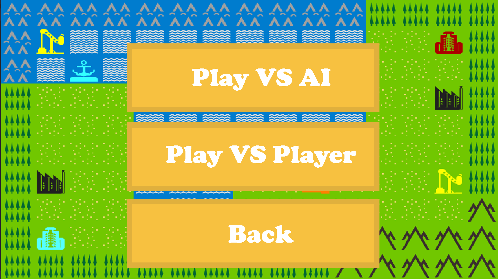
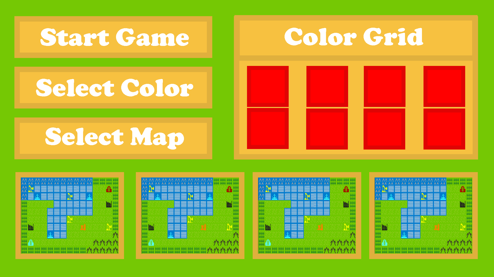
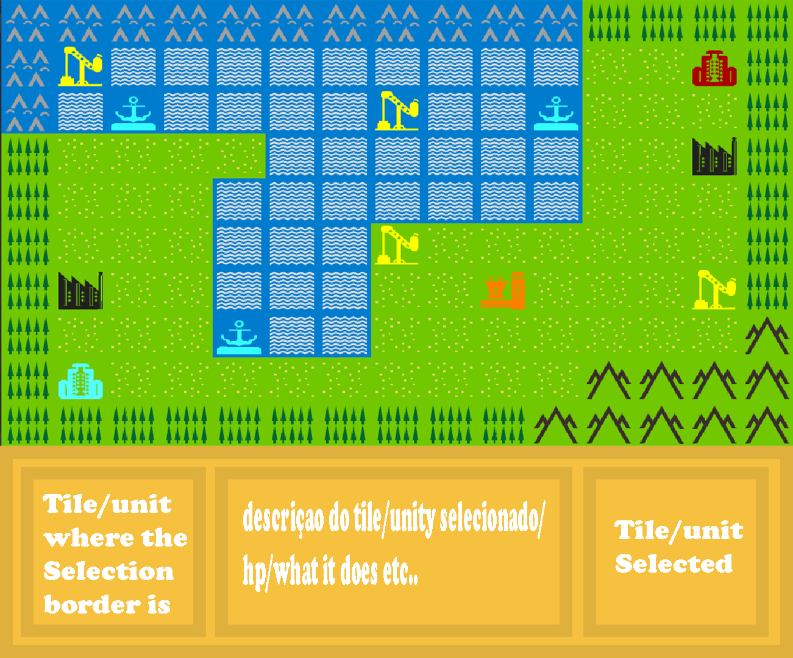
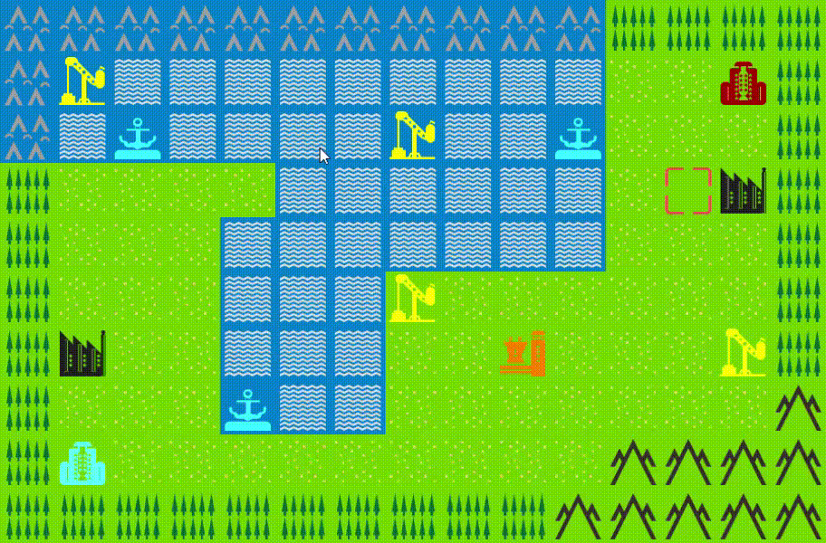

### LDTS_l04gr05 - ForwardWarfare

## Game Description
FowardWarfare is our recreation of the game called Advance Wars. It’s a series of turn-based strategy games developed by Intelligent Systems and published by Nintendo. The game was first released for the Game Boy Advance and features tactical battles between armies on a grid-based map. It offers challenging gameplay where players command various military units such as infantry, tanks, aircraft, and ships, each with unique abilities and characteristics. The objective is to defeat the enemy army, capture bases, and control facilities to obtain resources and additional units. 

## Mocks
Schematics of the future UI of the Game.

### Main Menu -> Start

Start screen where you can chose whether to play the game, learn how to play it or close it.

### Main Menu -> Enemy Selection

In this screen you can chose if you want to play agains the Computer or Another Player.

### Start Game Menu

This is where you select the game settings. You can choose the color for your troops and the map. 

### Game Battle

An mock of how the game screen will look like. You have the map above and under it a UI where you get information about the Tile/Troop currently selected and the tile/troop that the selector is hovering on the right. 

### In-Game Test of a Selection Border

