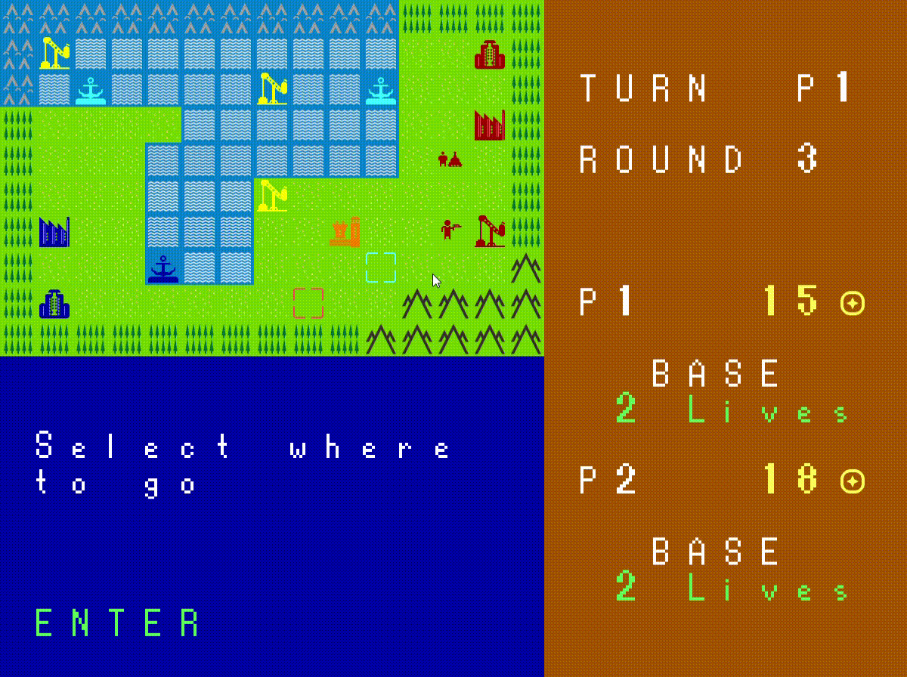
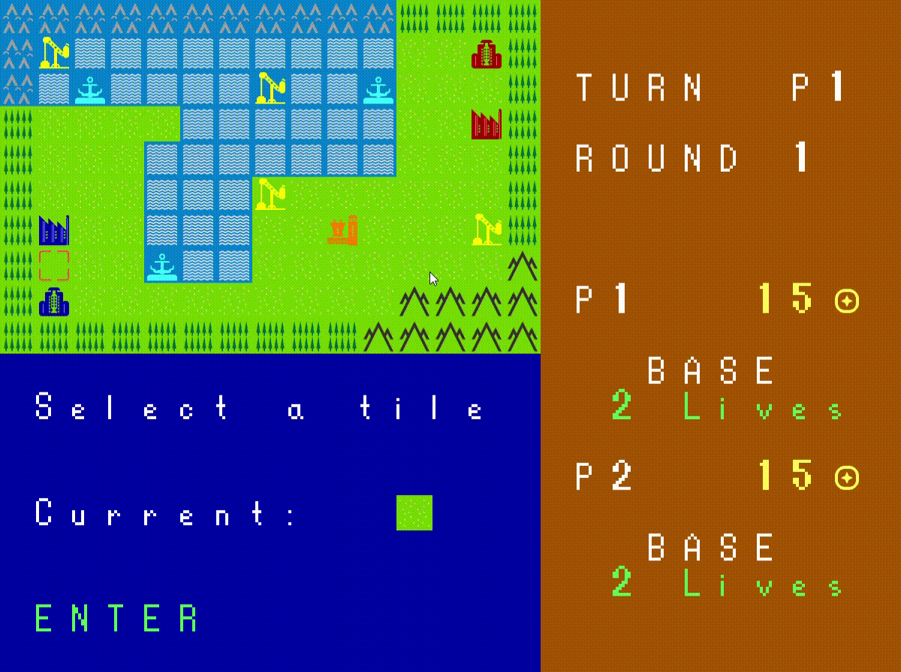

### LDTS_l04gr05 - ForwardWarfare

## Game Description
FowardWarfare is our recreation of the game called Advance Wars. It’s a series of turn-based strategy games developed by Intelligent Systems and published by Nintendo. The game was first released for the Game Boy Advance and features tactical battles between armies on a grid-based map. It offers challenging gameplay where players command various military units such as infantry, tanks, aircraft, and ships, each with unique abilities and characteristics. The objective is to defeat the enemy army, capture bases, and control facilities to obtain resources and additional units. 

## How to Play

### \*\*MISSING\*\*

## SCREENSHOTS / GIFS
The following screenshots shows the general look of our game.

### Main Menu -> Start

**Description:** Initial screen where you can choose whether to play the game, learn how to play it or close it.

### How to play

**Description:** Screen resulted by the "How to play" option in the Main Menu -> Start, it explains you the game and you can learn how to play it.

### Main Menu -> Enemy Selection

**Description:** In this screen you can choose if you want to play against another player or the Computer (AI player).

### Start Game Menu

**Description:** Screen where you select the game settings. You can choose the color for your troops and the map you want to play in. The color of the AI player is already predetermined as red.

### Game Battle

**Description**: Screen with the game battle. You have the map above and under it, a UI where you get information about the tile/troop currently selected and the tile/troop that the selector is hovering on the right. 

### Atack Gif

### Buy Troop Gif

