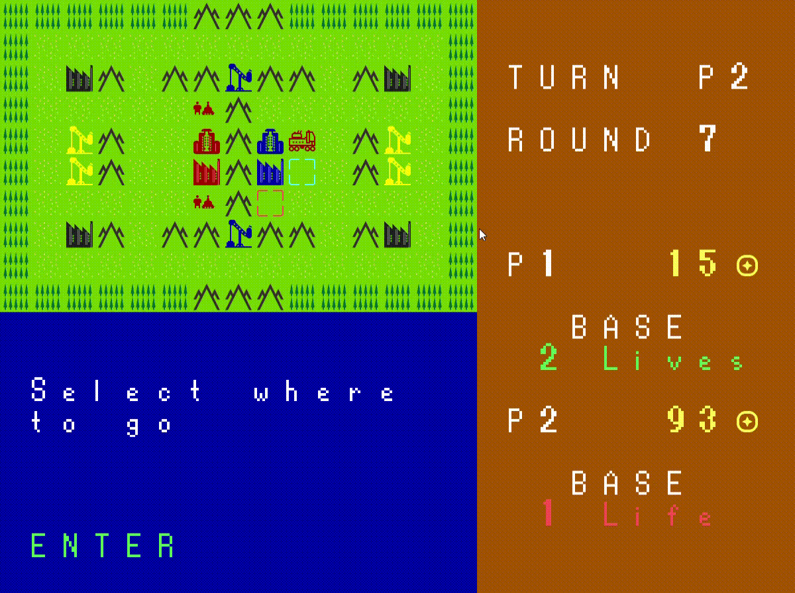
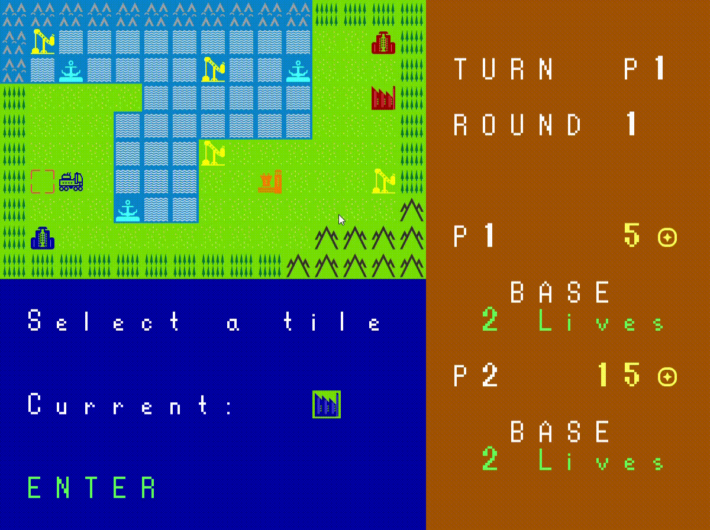

### LDTS_l04gr05 - ForwardWarfare

## GAME DESCRIPTION
FowardWarfare is our recreation of the game called Advance Wars. It’s a series of turn-based strategy games developed by Intelligent Systems and published by Nintendo. The game was first released for the Game Boy Advance and features tactical battles between armies on a grid-based map. It offers challenging gameplay where players command various military units such as infantry, tanks, aircraft, and ships, each with unique abilities and characteristics. The objective is to defeat the enemy army, capture bases, and control facilities to obtain resources and additional units. 

## HOW TO PLAY

The objective of our game is to defeat the enemy army, capture bases and control facilities to obtain coins and additional units. After moving a unit depending of your surroundings you can either capture nearby facilities or attack nearby enemy units.
The different types of facilities that exists are the bases, where to capture the enemy base to win the game takes two turns and those turns must be consecutive; factories, where you can buy one ground unit per round; airports, where you can buy one air unit per round; ports, where you can buy one sea unit per round as well and, finally, oilpumps, which gives you plus 10 income per round. 
Furthermore, there are some shortcut keys to help you during the game, they are, the "ESC" key (opens the menu or goes back to the default section), the "ENTER" key (confirms the action you want to make) and the arrows keys, which are the right, left, up and down, as the name suggest it moves you to the right, left, up, and down, respectively.

## SCREENSHOTS / GIFS
The following screenshots shows the general look of our game.

### Main Menu -> Start

**Description:** Initial screen where you can choose whether to play the game, learn how to play it or close it.

### How to play

**Description:** Screen resulted by the "How to play" option in the Main Menu -> Start, it explains you the game and you can learn how to play it.

### Main Menu -> Enemy Selection

**Description:** In this screen you can choose if you want to play against another player or the Computer (AI player).

### Start Game Menu

**Description:** Screen where you select the game settings. You can choose the color for your troops and the map you want to play in. The color of the AI player is already predetermined as red.

### Game Battle

**Description**: Screen with the game battle. You have the map above and under it, a UI where you get information about the tile/troop currently selected and the tile/troop that the selector is hovering on the right. 

### Atack Gif

**Description:** This gif serves as an example of how you can atack your opponent.

### Buy Troop Gif

**Description:** This gif shows you how to buy troops during your play.

### Capture Facility Gif

**Description:** Gif who shows you the process of how you can capture facilities during your move.

### End Game Gif

**Description:** This one shows you an example for when you loose the game.

### Gameplay Gif

**Description:** Example of a move during one turn, you can do a bunch of things like the ones we show you in this gif.

### Move Troop Gif

**Description:** This gif, as the title suggests, shows you how you can move your troops.
