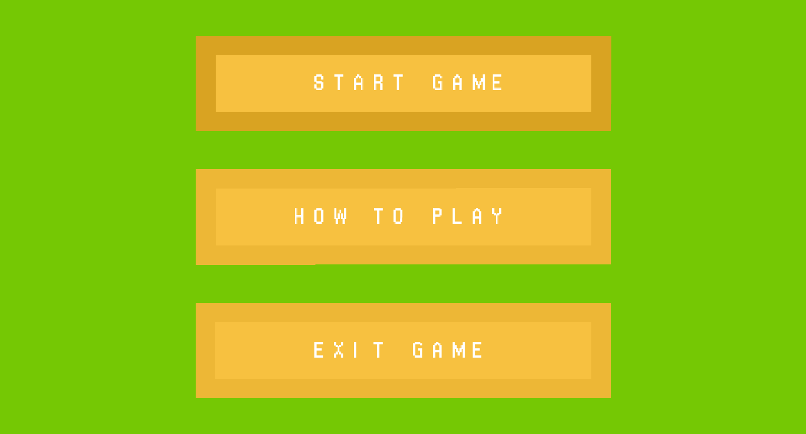
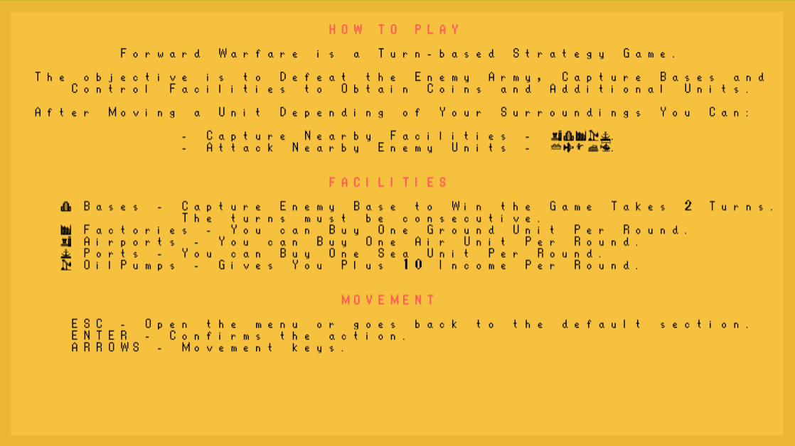
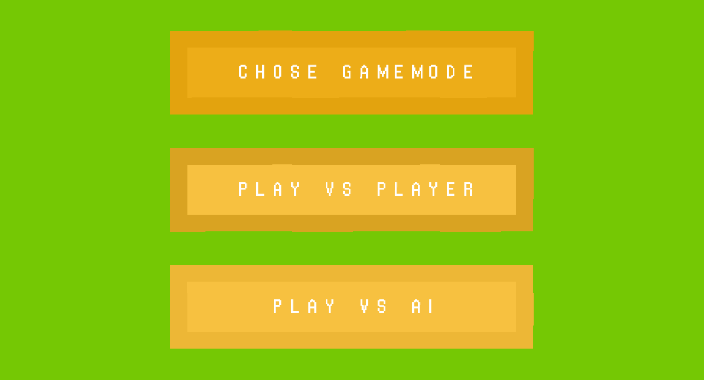
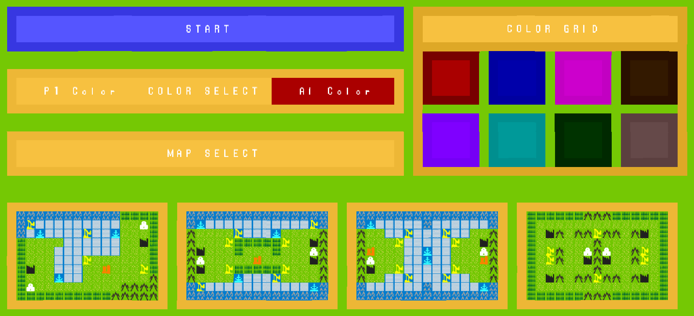
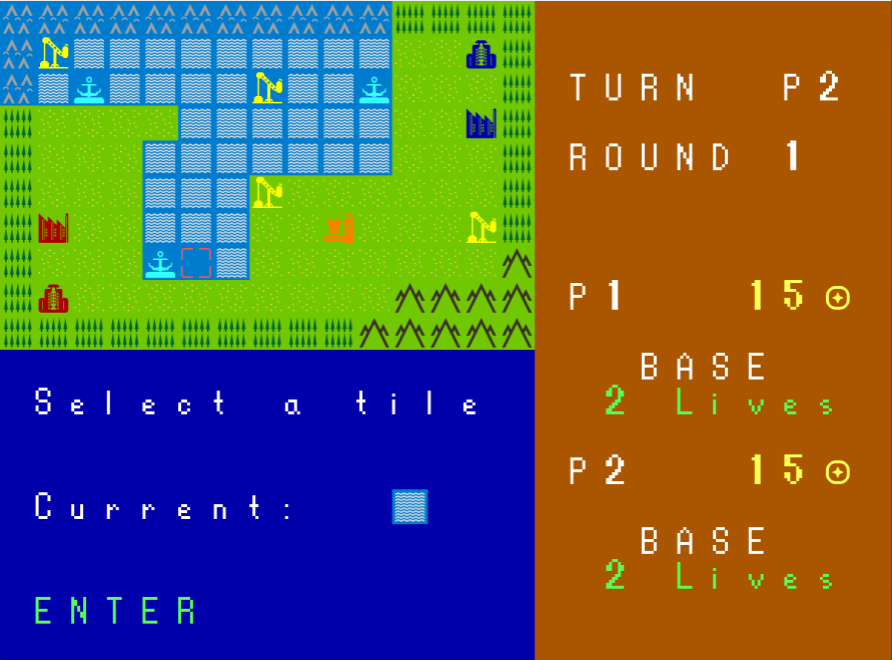
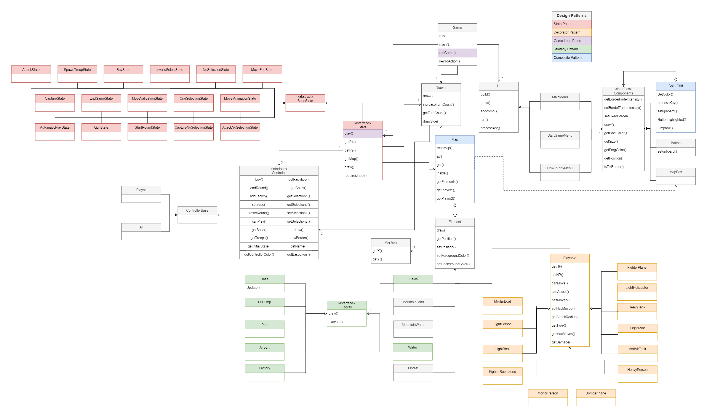
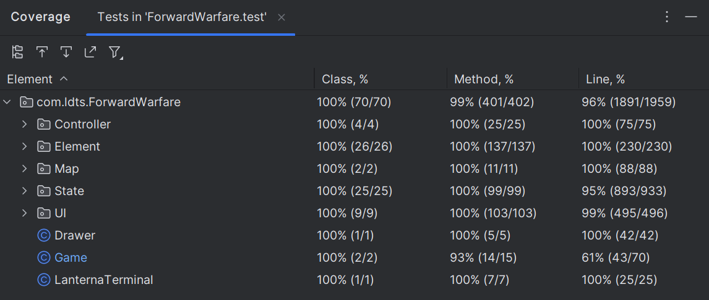

# LDTS_l04gr05 - ForwardWarfare

## GAME DESCRIPTION

FowardWarfare is our recreation of the game called Advance Wars. It’s a series of turn-based strategy games developed by Intelligent Systems and published by Nintendo. The game was first released for the Game Boy Advance and features tactical battles between armies on a grid-based map. It offers challenging gameplay where players command various military units such as infantry, tanks, aircraft, and ships, each with unique abilities and characteristics. The objective is to defeat the enemy army, capture bases, and control facilities to obtain resources and additional units.

For LDTS 2023/24, this project was developed by:

- Filipe Esteves up202206515@up.pt
- Gabriel Lima up202206693@up.pt
- Renata Simão up202205124@up.pt

## HOW TO PLAY

### \*\*MISSING\*\*

## IMPLEMENTED FEATURES

- **Map** - Loads a custom map using the format .fw, where a number corresponds to a tile.
  (currently only working by editing the file 1.fw)
- **Color** - you can choose the color of your player.

- **Map select** - Select the map you want to use.

- **Play** - you can play against AI or other person (like a friend for instance).

- **Interact with facilities to collect resources:**

  - **Collect coins** - a facility will give the game character coins in each round of the game.

  - **Use coins to get more troops**.

- **Defeat the base** - defeat your opponent's base to win the game.

- **Capture facilities:**

  - **Not owned**
  - **Owned by other player**

- **Kill other player troops**

- **Recovery** - Base recovers lifes if not attacked in two consecutive rounds

- **Movement** - move troops in the map, in order to reach other troops/facilities/base.

## PLANNED FEATURES

All the planned features were successfully implemented.

## Screenshots

The following screenshots shows the general look of our game.

### Main Menu -> Start

**Description:** Initial screen where you can choose whether to play the game, learn how to play it or close it.

### How to play

**Description:** Screen resulted by the "How to play" option in the Main Menu -> Start, it explains you the game and you can learn how to play it.

### Main Menu -> Enemy Selection

**Description:** In this screen you can choose if you want to play against another player or the Computer (AI player).

### Start Game Menu

**Description:** Screen where you select the game settings. You can choose the color for your troops and the map you want to play in. The color of the AI player is already predetermined as red.

### Game Battle

**Description**: Screen with the game battle. You have the map above and under it, a UI where you get information about the tile/troop currently selected and the tile/troop that the selector is hovering on the right.

### \*\*MISSING GAMEPLAY GIFS\*\*

## DESIGN

### UML DIAGRAM

  

  <b><i>Fig 1. Class UML</i></b>

### Tiles and Playable troops are similar in base composition

- **Problem in Context:** Tiles and Playable troops are quite similar in their base composition but differ only in some aspects, that being that troops can move and have life points, and that each tile does not have such funcionality.

- **The Pattern:** The decorator pattern is extremely useful in this case. By creating an abstract class, we can "decorate" the class with the required functions to make a troop playable.

- **Implementation:** Represented in Yellow in the UML.

  [Base abstract class - Element](../src/main/java/com/ldts/ForwardWarfare/Element/Element.java)

  [Decorator abstract class - Playable](../src/main/java/com/ldts/ForwardWarfare/Element/Playable/Playable.java)

  [Class that extends Playable - HeavyTank](../src/main/java/com/ldts/ForwardWarfare/Element/Playable/Ground/HeavyTank.java)

- **Consequences:** By having this implementation, every element in the map can be reduced to the Element type and it the functionality of each troop will remain if they are accessed thru a type cast.

### A water or field tile might contain a facility

- **Problem in Context:** A tile in our game, if of water or field type, might contain a facility. As there is various types of facilities, there need to be a way for the tile to store what facility is currently inside it.

- **The Pattern:** For this we choose the strategy pattern. By using it, we can define the facilities as "strategies" of how a tile behaves when interacted with by a player.

- **Implementation:** Represented in Green in the UML.

  Tiles -> [Field](../src/main/java/com/ldts/ForwardWarfare/Element/Tile/Fields.java) |
  [Water](../src/main/java/com/ldts/ForwardWarfare/Element/Tile/Water.java)

  [Facility](../src/main/java/com/ldts/ForwardWarfare/Element/Facility/Facility.java) ->
  [Factory](../src/main/java/com/ldts/ForwardWarfare/Element/Facility/Factory.java) |
  [OilPump](../src/main/java/com/ldts/ForwardWarfare/Element/Facility/OilPump.java) |
  [Other facilities](../src/main/java/com/ldts/ForwardWarfare/Element/Facility)

- **Consequences:** Those classes become responsible for the management of the facility, instead of having to store which facility is related to which tile.

### The game has a lot of phases

- **Problem in Context:** A game like ours need to be able to have all the information of each player and the map in the same place, in order to be able to handle a player action.

- **The Pattern:** For this, we decided to use the state pattern. This is due to the game having a set number of possible states and the necessity of determining the next state the game is gonna be in after each user input.

- **Implementation:** Represented in Red in the UML.

  [States](../src/main/java/com/ldts/ForwardWarfare/State/States/)

- **Consequences:** These pattern are useful as they allows us to have all the necessary map, player, troop and facility information in the same place. Furthermore, the state class becomes the brain of the game, managing everything that happens and allowing us to have a central loop (game loop pattern) that controls the game and read the user input.

### A combination of Components can also be a Component!

- **Problem in Context:** The UIs outside our game are composed of Components. A Color Grid is an abstraction of a set of Buttons, so it makes sense to represent this group also as an Component of the UI.

- **The Pattern:** We decided to use the Composite pattern so that all elements defined by the Composite pattern share a common interface Components.

- **Implementation:** Represented in Blue in the UML.

  [Components](../src/main/java/com/ldts/ForwardWarfare/UI/Component/Component.java)

  [ColorGrid](../src/main/java/com/ldts/ForwardWarfare/UI/Component/ColorGrid.java)

- **Consequences:** Using this pattern, the client code doesn’t have to worry about the concrete class of the objects it is working with since they all depend on the interface Components.

### A combination of Elements can also be a Element!

- **Problem in Context:** All the Elements of our Game are derivatives from the Element Class. A Map is an abstraction of a set of Elements, so it makes sense to represent this group also as an Element.

- **The Pattern:** We decided to use the Composite pattern so that all elements defined by the Composite pattern share a common parent class Elements.

- **Implementation:** Represented in Blue in the UML.

  [Elements](../src/main/java/com/ldts/ForwardWarfare/Element/Element.java)

  [Map](../src/main/java/com/ldts/ForwardWarfare/Map/Map.java)

- **Consequences:** Using this pattern, the client code doesn’t have to worry about the concrete class of the objects it is working with since they all depend on the class Elements.

### A game need to be able to handle user input

- **Problem in Context:** In order to play a game, the screen needs to update according to user input. To achieve this, there is a need for a pattern that handles an infinite loop and waits for user input.

- **The Pattern:** To achieve this, we used a Game Loop pattern, which loops infinitely asking the state how to procceed and if user input is needed.

- **Implementation:** Represented in Purple in the UML.

  [Game -> RunGame()](../src/main/java/com/ldts/ForwardWarfare/Game.java#91)

- **Consequences:** A game loop runs continuously during the gameplay. Each turn of the loop processes user input, waiting for it or not depending on the state the game is in, updates the game state, and renders the game.

## Error prone

### MissingCasesInEnumSwitch

In most states, we use a switch statement to define what behaviour happen given user's input. As some inputs are not always valid in some states, there are no cases for those. Having a default case, with just a break statement could solve this warning, but after all, there behaviour would always be the same.

### CatchAndPrintStackTrace

In a project meant for release to the public, having a robust logging system would be the obvious choice to make. But given the scope of the project, printStackTrace is suficient to provide information about the exception that happen during execution.

### EmptyCatch

There are some try statements used to avoid Exceptions to objects that don't have much impact to the rest of the code. In this case, the having the stack trace of this exception is not that valuable and as such, we discard the exception.

A good example is the sleep in [MoveAnimationState](../src/main/java/com/ldts/ForwardWarfare/State/States/Player/Move/MoveAnimationState.java#32). This statement enables us to make a small move animation by delaying the execution of the program. Despite this, such sleep failing by any reason does not result in an important problem and so the related exception can be ignored.

### StringSplitter

Even though String.split() might have weird behaviour when spliting things like "" or ":" (being : the separator), this behaviour has no impact on the place it is being used.

In [InvalidSelectState](../src/main/java/com/ldts/ForwardWarfare/State/States/Player/Selection/InvalidSelectState.java#31), the split method spaces enables us to "push" the text down by only adding "\n" to the message. This way, with two "\n" or more in a row, it is possible to center test or to do paragraphs.

## Code smells

The main code smells that we have found in our project are:

### Duplicade Code

Some code or method is duplicated within some classes. This happens because, even though that particular piece of code is the same, the rest of the class is different enough that there is a need for it to be separated.

One example of this is the withinRadius method present in the classes:
[AttackNoSelectionState](../src/main/java/com/ldts/ForwardWarfare/State/States/Player/Selection/Attack/AttackNoSelectionState.java)
[CaptureNoSelectionState](../src/main/java/com/ldts/ForwardWarfare/State/States/Player/Selection/Attack/AttackNoSelectionState.java)

The process that both classes follow to obtain the object that the player can capture/attack is quite similar, but as the Facilities and Troops are stored in a different way, this duplication of code is warranted.

### Long Method

Long methods should be avoided to keep code clearity and simplicity. But this is not always viable nor easy to do.

The biggest infringers of this rethoric is the [AutomatedLogic](../src/main/java/com/ldts/ForwardWarfare/State/States/Automatic/AutomaticPlayState.java#53) method in [AutomaticPlayState](../src/main/java/com/ldts/ForwardWarfare/State/States/Automatic/AutomaticPlayState.java). Given that it tries to simulate a player, it is essential to have the entire logic for the randomness and what moves are gonna be executed in the same place.

### Long Parameter list

Having a long parameter list in a method can also reduce code clarity. It is rare for a method in our code to have more than 2/3 parameters, but in some cases it can reach 6 parameters.

One such case is the constructor for [SpawnTroopState](../src/main/java/com/ldts/ForwardWarfare/State/States/Player/SpawnTroopState.java#25). This could be solved by wrapping some of the parameters in its own class, but given the scarcity of a method like this we opted for keeping it in this form.

## Testing

### Screenshot of coverage report

  

  <b><i>Fig 2. Code coverage screenshot</i></b>

### Link to mutation testing report

[Mutation tests](./reports/pitest/index.html)

## Self-evaluation

- Felipe Esteves: **40%**
- Gabriel Lima: **45%**
- Renata Simões: **15%**
